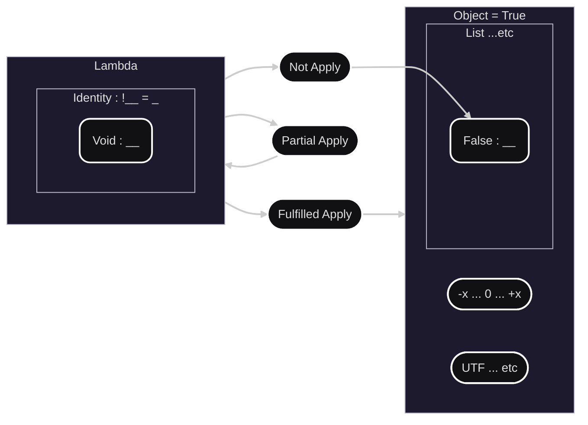
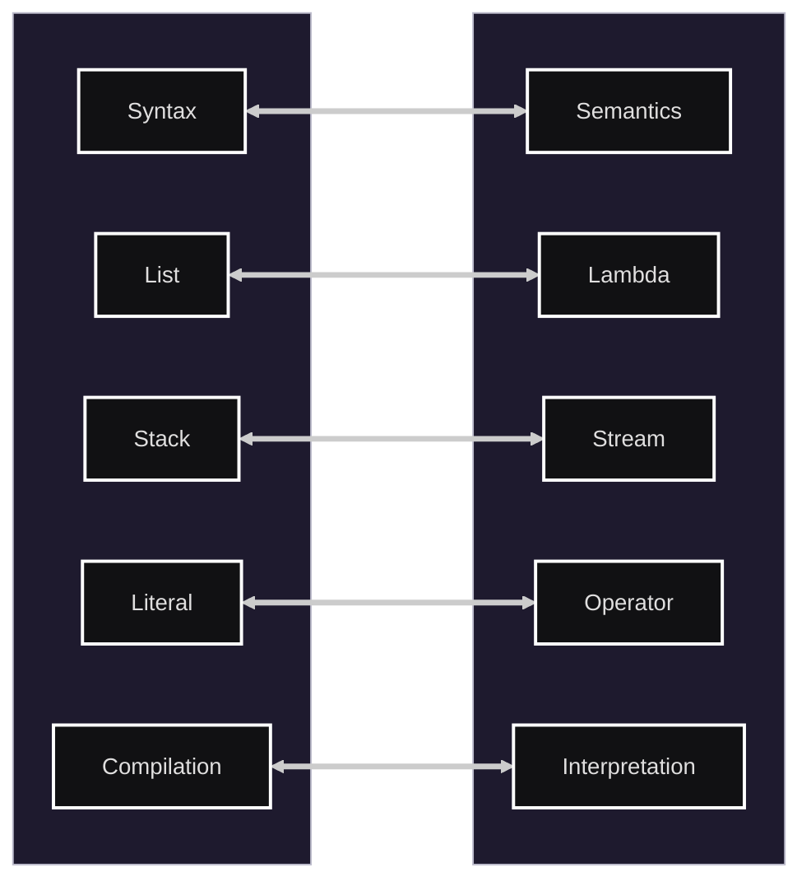

# Sign integrity generic notation


Welcome to the Sign integrity generic notation Page!

This is a language for expressing the integrity of data evaluation generic way.
It is designed to be used in various Anyone, such as data validation, integrity checks, and Functional Effects.

## Manifesto

* [Our Manifesto](./documents/manifesto/manifesto.en-us.md)
* [日本語版はこちら](./documents/manifesto/manifesto.ja-jp.md)

## Example

* [language example](./documents/en-us/example.en-us.sn)
* [日本語はこちら](./documents/ja-jp/example.ja-jp.sn)

## Reference

* [language reference](./documents/en-us/Sign_reference_en-us.md)
* [日本語はこちら](./documents/ja-jp/Sign_reference_ja-jp.md)

## Specification

* [language specification](./documents/en-us/specification/)
* [日本語はこちら](./documents/ja-jp/specification/)

## License

* [Language-License](./documents/License/sign-language-license.en-us.md)
* [日本語はこちら](./documents/License/sign-language-license.ja-jp.md)

## Concept view





## Playground

The playground lives in `alpha/javascript` — the interpreter currently under development
(lexer → Pass1/1b/2/3 → interpreter). Use it to try the language as it actually behaves today.

### alpha/javascript Playground（アクティブな実装。基本こちらを使ってください）

#### Windows ユーザー向けのかんたんセットアップ (For Windows Users)

初めて実行される方や、Node.js や npm の操作に不慣れな方は、専用のインストールスクリプトをご用意しております。

1. エクスプローラーで `install_alpha.ps1` を右クリックし、「PowerShell で実行」を選択してください。（またはターミナルから `./install_alpha.ps1` を実行します）
2. Node.js がインストールされていない場合は、画面の指示に従って自動インストールが可能です。
3. 必要なデータのダウンロードとパーサーの生成が完了すると、自動的に Playground が起動いたします。

**※2回目以降の起動について**
セットアップ完了後は、`sign_alpha_web.ps1` を実行していただくだけで、いつでも Playground を起動できます。

#### その他の起動方法 (Manual Launch Methods)

- **npm script**:
  ```bash
  cd alpha/javascript
  npm install
  npm run build:parser
  npm run playground
  ```
- **Shell script** (for macOS/Linux/Git Bash): `./sign_alpha_web.sh`
- **PowerShell script** (for Windows PowerShell): `.\sign_alpha_web.ps1`

This starts a local server at `http://localhost:5183` and automatically opens your default web browser. `sign.pegjs`（正式仕様）を編集した場合は、`npm run build:parser` を再実行しないと Playground に反映されない点に注意してください。

