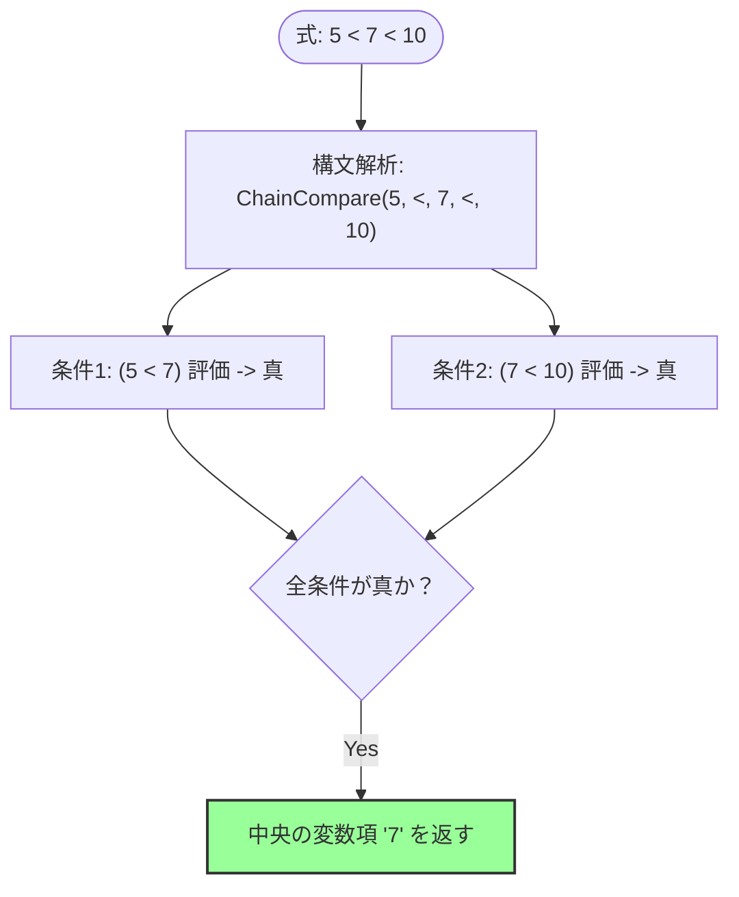

# 比較演算子の値返却と連鎖評価（Chaining）における代数的仕様

## 1. 概要

Sign言語における比較演算（`<`, `>`, `<=`, `>=`, `=`, `!=`）は、条件が真のときに特定のオペランドの値を返し、偽のときに `__`（Unit/Nothing）を返します。この挙動は、条件フィルタリングやモナド的伝播を簡潔に表現するためのものです。

> [!NOTE]
> **`_`（Hole）と `__`（Unit）は明確に異なる概念。**
> - `_` ：字句的に記述されたプレースホルダ。コンパイル時に部分適用（Lambda）へ静的脱糖される。
> - `__`：実行時に流通する Unit 値。「値の不在・偽・空」を表す。
> 本仕様書では比較演算の返値は常に `__`（Unit）を使用する。

本仕様書では、従来の構文カテゴリ（リテラルか変数か）に基づく判定を排し、**「左辺の値が代数的単位元であるか否か」**という値ベースの代数的ルールを導入することで、指示的意味論（指示の同一性および参照透明性）と直感的な三項連鎖比較（`1 < x < 10` 等で中央の項を返す挙動）を両立させる仕様を定義します。

---

## 2. 評価規則と代数的ディスパッチ

比較演算子 `op`（例: `<`）を二つの引数 `LHS`（左辺）と `RHS`（右辺）に適用した際、評価結果 $V$ は以下の規則に従って決定されます。

### 2.1 定義式

$$ V = \text{eval}(LHS \text{ op } RHS) = \begin{cases} 
\text{select}(LHS, RHS) & (\text{比較条件が真の場合}) \\
\_ & (\text{比較条件が偽の場合})
\end{cases} $$

ここで、返すオペランドを選択する関数 $\text{select}(LHS, RHS)$ は、**左辺の「値」**に基づき以下のように定義されます。

$$\text{select}(LHS, RHS) = \begin{cases} 
RHS & (\text{value}(LHS) \in \{0, 1\}) \\
LHS & (\text{上記以外})
\end{cases}$$

* **単位元（例外ルール）**: 左辺の**数値**が `0`（加法単位元）、`1`（乗算単位元）のいずれかである場合、**右辺（RHS）の値**を返します。
* **通常ルール**: それ以外の場合、**左辺（LHS）の値**を返します。（余積単位元 `__` の場合は、算術演算の単位元ではないため、左辺の値を返します。）

> [!IMPORTANT]
> **`{0, 1}` の判定は「数値ドメインの算術単位元であること」を対象とする。幅クラスは問わない。**
>
> | 値 | Layer 2 型 | `{0,1}` 判定対象 |
> |---|---|:---:|
> | `0`, `1` | `Int` / `Address` | ✅ |
> | `0.0`, `1.0` | `Float` | ✅ |
> | `0u....`（Unicode型） | `Char` | ❌（文字は算術ドメインではない） |
> | `[0]`（List） | `List` | ❌（値ではなくリスト） |
> | `\a`（文字型） | `Char` | ❌（文字は算術ドメインではない） |
> | `` `...` `` | `String` | ❌（器） |
>
> 対象は Layer 2 型が数値（`Int` / `Address` / `Float` / `Vector`）であるものに限る。
>
> **本書は以前、Float を判定対象外としていた（2026-08-09 修正）。** ℝ は体であり、
> `0` は加法単位元、`1` は乗算単位元として ℤ とまったく同格に存在する以上、
> 「Float には単位元が無い」という扱いには根拠が無かった。除外を維持すると
> 「Float の比較だけは常に左辺を返す」という、同じ演算子が左辺の幅クラスによって
> 振る舞いを変える非対称が生じてしまう（[`type_system.md` §3.2](type_system.md#32-左辺優先ルールlayer-2-に依存) が
> 族の内部で規則を割らない方針を採っているのと矛盾する）。
>
> なお「浮動小数点の等値比較は不安定なので除外すべき」という論拠も成立しない。
> 判定はリテラル `0`/`1` との完全一致であり、計算結果の float が脆いのは
> この規則に固有の問題ではない。
>
> 同時に **`Int` という語も廃した**——Sign の Layer 2 に `Int` 型は存在せず、
> 符号なし整数は `Address` に包含される（[`type_system.md` §2](type_system.md#layer-2-atom-内部型atom-subtype)）。
> 旧版の表が `Int` と「アドレス型」を別ドメインとして扱い、後者を判定対象外としていたのは
> この用語の取り違えによるものであり、実装可能な区別ではなかった。
>
> **その後 2026-08-18 に `Int` と `Address` は分け直された**（溢れ方が違うため、
> [`type_system.md` §2](type_system.md#layer-2-atom-内部型atom-subtype)）。上の段落は当時の記録で、今の判定対象は
> `Int` / `Address` / `Float` / `Vector` である。
>
> **`==` / `!==`（構造比較）は本ルールの適用外。**
> `==` および `!==` は Atom の単位元（0 および 1）という概念が構造比較には適用できないため（単位元自体が `__` になり得る）、常に「真なら LHS 、偽なら `__`」の単純ルールを適用する。

---

## 3. 指示的意味論（参照透明性）の保証

本仕様の最大の特徴は、返却値の選択が構文木（リテラルか変数か）ではなく、評価された**「値そのもの」**に依存する点にあります。

### 3.1 参照透明性の証明

変数 `a` が `1` に束縛されている環境（$[\![ a ]\!] = 1$）において、式 $f(x) = x < 5$ を評価します。

#### パターンA: 引数がリテラル `1` の場合
1. $[\![ 1 < 5 ]\!]$ を評価。比較は真。
2. 左辺 $1$ は乗算単位元であるため、右辺の値 $5$ を選択。
3. 結果は $5$ となる。

#### パターンB: 引数が変数 `a` の場合
1. $[\![ a < 5 ]\!]$ を評価。
2. 左辺 $a$ の評価値 $[\![ a ]\!] = 1$ を取得。比較は真。
3. 評価値 $1$ は乗算単位元であるため、右辺の値 $5$ を選択。
4. 結果は $5$ となる。

これにより、プログラム内の表現に関わらず以下の等価性が完全に維持されます。

$$ [\![ f(1) ]\!] = [\![ f(a) ]\!] = 5 $$

---

## 4. 三項連鎖比較（`L < C < R`）の構文解析と評価フロー

`L < C < R` のような三項比較の連鎖は、二項演算の左結合（`(L < C) < R`）として評価するのではなく、構文解析（パーサー）の段階で**特別な連鎖構文（ASTノード `ChainCompare`）として解釈**されます。

これにより、二項比較における「指示的意味論（参照透明性）」を完全に維持しつつ、「比較連鎖では中央の変数項を抽出したい」という直感的な挙動を両立します。

### 4.1 連鎖構文の制約と評価ルール

* **構文の制約**: 3項以上の比較になる場合、**同一の比較演算子の連鎖のみが許容**されます（例: `A < B < C` や `A <= B <= C` は可。`A < B > C` は構文エラー）。
* **推移性の制約**: 連鎖できるのは**推移的な比較演算子だけ**です。すなわち `a R b` かつ `b R c` から `a R c` が導けるものに限ります。連鎖可能なのは `<` `<=` `=` `>=` `>` の5つで、**`!=` は連鎖できません（構文エラー）**。理由は §4.3 に述べます。
* **評価ルール**: 
  1. 連鎖するすべての隣接ペア（例: `L < C` と `C < R`）を評価します。ただし継続の規則に従い、零射（`__`）へ落ちた時点で結果が `__` に確定するため、それより右の項は評価しません（[`operator_table.md`](../syntax/operator_table.md) 「Unit 欄の読み方（射と継続）」）。連鎖可能な5演算子はいずれも左辺 Unit で零射になるため、この短絡に例外はありません。
  2. 全ての比較が「真」である場合、**無条件で中央の項（`C`）の値を返します**。
  3. いずれかの比較が「偽」である場合、即座に `__`（Unit）を返します。

### 4.2 例: `5 < x < 10` (x = 7 の場合)



このASTレベルの解決により、式の下限値が `0` や `1`（算術単位元）であるかに依存せず、任意の値（例：`5`）を用いた場合でも、常に期待通りに中央の変数項を安全に抽出できます。

### 4.3 `!=` が連鎖できない理由（推移性）

§4 の連鎖が「中央の項を取り出す」という形で意味を持つのは、**隣接ペアの真偽が単一の関係へ畳めるから**です。`5 < 7 < 10` は「7 が 5 と 10 の間にある」というひとつの命題であり、`5 < 10` も導けます。連鎖可能な5演算子はいずれも推移的で、この畳み込みが常に成立します。

`!=` は推移的ではありません。`a != b` かつ `b != c` から `a != c` は導けません。

```text
3 != 5   真
5 != 3   真
--------------
3 != 3   偽        ← 隣接ペアが両方真でも、両端は等しくありうる
```

したがって `3 != 5 != 3` は「隣接ペアが全て真」を満たしてしまいます。これを「3項が相異なる」と読んだ書き手は黙って誤った結果を得ることになります。畳めない以上、中央の項に「両端との関係」という意味を与えられず、連鎖の目的そのものが成立しません。

「隣接ペアの連言」という意味を残す選択肢もありますが、それは連鎖記法が与える直感（範囲・区間）と食い違う一方、明示的に書けば済むことです。**書き手の意図を静的に確定できない以上、値を返さず構文エラーにします**（[`0_design_principles.md`](../0_design_principles.md) 原理4）。

意図に応じて明示的に書いてください。

```sign
` 中央が両端のどちらとも異なる
(a != b) & (b != c)

` 3項が相異なる
(a != b) & (b != c) & (a != c)
```

なお構造比較の `==` / `!==` は §2.1 の適用外であり、そもそも §4 の連鎖対象ではありません。

---

## 5. モナド的フィルターとしての応用例

値返却型比較と単位元ルールにより、Sign言語は `Maybe` モナドや条件付き制御フロー（If-Then）を関数合成の中でノイズなく記述できます。

### 5.1 条件付き加算パイプライン

値 `x` が正の数の場合のみ `5` を足し、そうでない場合は `__`（Unit）を伝播させる処理：

```sign
` x > 0 は真なら x (LHS) を返し、偽なら __ を返す
result : [x > 0] + 5
```

* **$x = 10$ の場合**:
  1. `10 > 0` $\rightarrow$ LHSは $10$（非単位元） $\rightarrow$ $10$ を返す。
  2. `10 + 5` $\rightarrow$ $15$ を返す。
* **$x = -3$ の場合**:
  1. `-3 > 0` $\rightarrow$ 偽 $\rightarrow$ `__` を返す。
  2. `__ + 5` $\rightarrow$ `__` を返す（Unitの伝播）。

### 5.2 境界値を含む論理積（AND）による結合範囲チェック

```sign
` x が 1 より大きく、かつ 10 より小さい場合に x を得る
valid_x : [1 < x] & [x < 10]
```

1. `1 < x` $\rightarrow$ LHSは $1$（単位元） $\rightarrow$ 真なら $x$ を返す。
2. `&` 演算子 $\rightarrow$ 左辺が真（非Unit）なら右辺を評価。
3. `x < 10` $\rightarrow$ LHSは $x$（非単位元） $\rightarrow$ 真なら $x$ を返す。
4. 結果として、条件を満たせば $x$、満たさなければ `__` となり、三項表記（`1 < x < 10`）と完全に同一の指示を持ちます。
